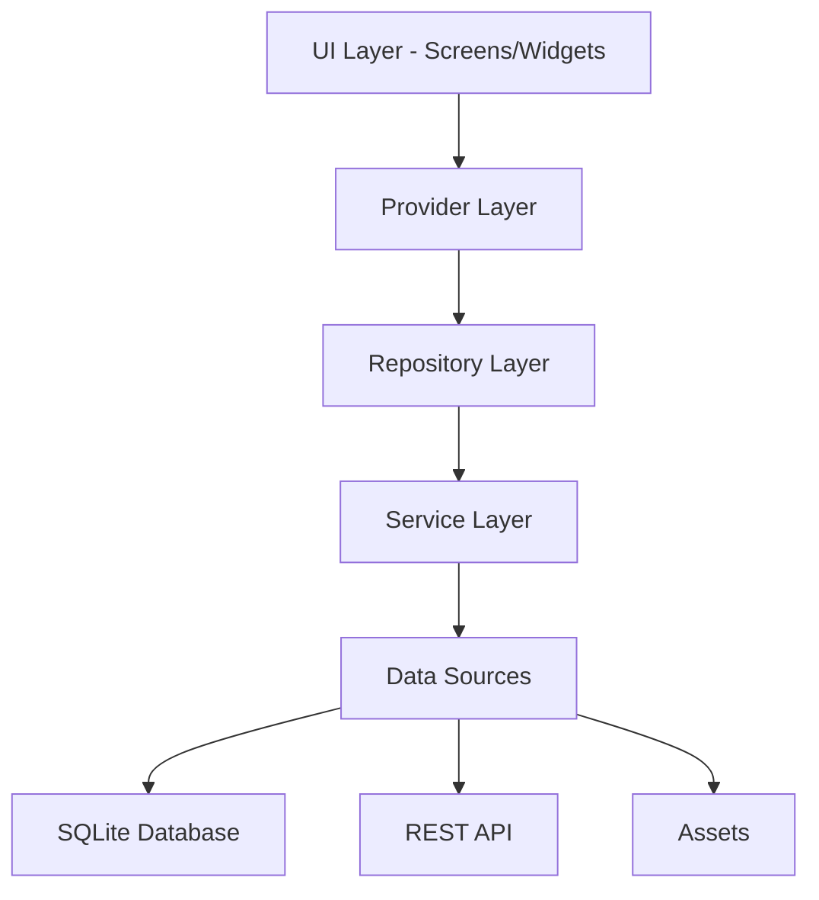

# Tài Liệu Thiết Kế

## Tổng Quan

Ứng dụng đọc sách điện tử nâng cao sẽ được xây dựng bằng Flutter với kiến trúc phân lớp rõ ràng, sử dụng Provider cho quản lý trạng thái, SQLite cho lưu trữ cục bộ, và tích hợp API để lấy danh mục sách. Ứng dụng tập trung vào trải nghiệm người dùng mượt mà với hiệu ứng chuyển trang, tùy chỉnh giao diện, và tự động lưu tiến trình đọc.

## Kiến Trúc

### Cấu Trúc Tổng Thể

Ứng dụng sẽ tuân theo kiến trúc MVVM (Model-View-ViewModel) kết hợp với pattern Repository:

```
lib/
├── main.dart
├── models/
│   ├── book.dart
│   ├── reading_state.dart
│   └── user_settings.dart
├── providers/
│   ├── book_provider.dart
│   ├── settings_provider.dart
│   └── reading_state_provider.dart
├── repositories/
│   ├── book_repository.dart
│   └── settings_repository.dart
├── services/
│   ├── api_service.dart
│   ├── database_service.dart
│   └── asset_reader_service.dart
├── screens/
│   ├── home_screen.dart
│   ├── book_list_screen.dart
│   ├── book_reader_screen.dart
│   └── settings_screen.dart
└── widgets/
    ├── book_card.dart
    ├── page_viewer.dart
    ├── control_panel.dart
    └── animated_settings_panel.dart
```

### Luồng Dữ Liệu



## Thành Phần và Giao Diện

### 1. Models

#### Book Model
```dart
class Book {
  final String id;
  final String title;
  final String author;
  final String description;
  final String? coverImageUrl;
  final String assetPath;
  
  Book({
    required this.id,
    required this.title,
    required this.author,
    required this.description,
    this.coverImageUrl,
    required this.assetPath,
  });
  
  factory Book.fromJson(Map<String, dynamic> json);
  Map<String, dynamic> toJson();
}
```

#### ReadingState Model
```dart
class ReadingState {
  final String bookId;
  final int currentPage;
  final int totalPages;
  final DateTime lastReadAt;
  
  ReadingState({
    required this.bookId,
    required this.currentPage,
    required this.totalPages,
    required this.lastReadAt,
  });
  
  factory ReadingState.fromMap(Map<String, dynamic> map);
  Map<String, dynamic> toMap();
}
```

#### UserSettings Model
```dart
class UserSettings {
  final bool isDarkMode;
  final double fontSize; // 14.0, 18.0, 22.0
  
  UserSettings({
    required this.isDarkMode,
    required this.fontSize,
  });
  
  factory UserSettings.fromMap(Map<String, dynamic> map);
  Map<String, dynamic> toMap();
}
```

### 2. Services

#### DatabaseService
Quản lý kết nối và thao tác với SQLite database.

**Chức năng:**
- Khởi tạo database với các bảng: `reading_states`, `user_settings`, `cached_books`
- Cung cấp các phương thức CRUD cho từng bảng
- Xử lý migration và version control

**Schema Database:**
```sql
CREATE TABLE reading_states (
  book_id TEXT PRIMARY KEY,
  current_page INTEGER NOT NULL,
  total_pages INTEGER NOT NULL,
  last_read_at TEXT NOT NULL
);

CREATE TABLE user_settings (
  id INTEGER PRIMARY KEY CHECK (id = 1),
  is_dark_mode INTEGER NOT NULL,
  font_size REAL NOT NULL
);

CREATE TABLE cached_books (
  id TEXT PRIMARY KEY,
  title TEXT NOT NULL,
  author TEXT NOT NULL,
  description TEXT,
  cover_image_url TEXT,
  asset_path TEXT NOT NULL,
  cached_at TEXT NOT NULL
);
```

#### ApiService
Xử lý các yêu cầu HTTP đến API sách.

**Endpoints:**
- `GET /books` - Lấy danh sách tất cả sách
- `GET /books/{id}` - Lấy chi tiết một cuốn sách

**Xử lý lỗi:**
- Timeout: 10 giây
- Retry logic: 3 lần với exponential backoff
- Fallback: Sử dụng cached data nếu API thất bại

#### AssetReaderService
Đọc nội dung sách từ thư mục assets.

**Chức năng:**
- Đọc file text từ assets
- Parse nội dung thành các trang dựa trên kích thước màn hình và font size
- Cache nội dung đã parse để tăng hiệu suất

### 3. Repositories

#### BookRepository
Trung gian giữa providers và services cho dữ liệu sách.

**Phương thức:**
- `Future<List<Book>> fetchBooks()` - Lấy sách từ API, fallback sang cache
- `Future<String> getBookContent(String bookId)` - Đọc nội dung sách từ assets
- `Future<void> cacheBooks(List<Book> books)` - Lưu cache danh sách sách

#### SettingsRepository
Quản lý lưu trữ và truy xuất cài đặt người dùng.

**Phương thức:**
- `Future<UserSettings> getSettings()` - Lấy cài đặt hiện tại
- `Future<void> saveSettings(UserSettings settings)` - Lưu cài đặt
- `Future<ReadingState?> getReadingState(String bookId)` - Lấy trạng thái đọc
- `Future<void> saveReadingState(ReadingState state)` - Lưu trạng thái đọc

### 4. Providers (State Management)

#### SettingsProvider
Quản lý trạng thái cài đặt người dùng sử dụng ChangeNotifier.

**State:**
- `UserSettings currentSettings`
- `bool isLoading`

**Methods:**
- `void toggleTheme()`
- `void setFontSize(double size)`
- `Future<void> loadSettings()`
- `Future<void> saveSettings()`

#### BookProvider
Quản lý danh sách sách và trạng thái loading.

**State:**
- `List<Book> books`
- `bool isLoading`
- `String? errorMessage`

**Methods:**
- `Future<void> loadBooks()`
- `Future<void> retryLoadBooks()`

#### ReadingStateProvider
Quản lý trạng thái đọc cho sách hiện tại.

**State:**
- `ReadingState? currentState`
- `String? currentBookContent`
- `List<String> pages`

**Methods:**
- `Future<void> loadBook(String bookId)`
- `void goToPage(int pageNumber)`
- `Future<void> saveCurrentPage()`

### 5. Screens

#### HomeScreen
Màn hình chính hiển thị danh sách sách từ API.

**Components:**
- AppBar với nút settings
- GridView/ListView hiển thị BookCard widgets
- Pull-to-refresh functionality
- Loading indicator và error handling UI

#### BookReaderScreen
Màn hình đọc sách với PageView và control panel.

**Components:**
- PageView.builder cho hiệu ứng lật trang
- AnimatedContainer cho control panel (ẩn/hiện khi tap)
- Progress indicator (trang hiện tại / tổng số trang)
- Nút back và settings

**Animations:**
- Page flip transition: Sử dụng PageView với custom PageTransformer
- Control panel: AnimatedContainer với slide-in/slide-out từ bottom
- Smooth font size transition khi thay đổi

#### SettingsScreen
Màn hình cài đặt cho theme và font size.

**Components:**
- Switch cho dark mode
- Slider hoặc buttons cho font size selection
- Preview text để xem thay đổi real-time

## Mô Hình Dữ Liệu

### Quan Hệ Giữa Các Entities

```mermaid
erDiagram
    BOOK ||--o{ READING_STATE : has
    USER_SETTINGS ||--|| USER : belongs_to
    
    BOOK {
        string id PK
        string title
        string author
        string description
        string coverImageUrl
        string assetPath
    }
    
    READING_STATE {
        string bookId PK,FK
        int currentPage
        int totalPages
        datetime lastReadAt
    }
    
    USER_SETTINGS {
        int id PK
        bool isDarkMode
        double fontSize
    }
```



## Xử Lý Lỗi

### Chiến Lược Xử Lý Lỗi

1. **API Errors:**
   - Network timeout: Hiển thị snackbar với nút retry
   - Server error (5xx): Sử dụng cached data, thông báo cho user
   - Client error (4xx): Hiển thị error message cụ thể

2. **Database Errors:**
   - Write failure: Retry 3 lần, sau đó thông báo user
   - Read failure: Sử dụng default values
   - Migration failure: Reset database (với user confirmation)

3. **Asset Loading Errors:**
   - File not found: Hiển thị placeholder message
   - Parse error: Log error, hiển thị raw content nếu có thể

### Error Handling Pattern

```dart
try {
  // Operation
} on NetworkException catch (e) {
  // Handle network errors
  showRetryDialog();
} on DatabaseException catch (e) {
  // Handle database errors
  logError(e);
  showErrorSnackbar();
} catch (e) {
  // Handle unexpected errors
  logError(e);
  showGenericErrorMessage();
}
```

## Chiến Lược Testing

### 1. Unit Tests
- Test tất cả models (fromJson, toJson, toMap, fromMap)
- Test business logic trong repositories
- Test state management logic trong providers
- Test utility functions và helpers

### 2. Widget Tests
- Test individual widgets (BookCard, PageViewer, ControlPanel)
- Test screen layouts và interactions
- Test animations và transitions

### 3. Integration Tests
- Test luồng hoàn chỉnh: Launch app → Load books → Open book → Read → Save state
- Test offline mode với cached data
- Test settings persistence across app restarts

### Test Coverage Target
- Minimum 70% code coverage
- 100% coverage cho critical paths (save reading state, load settings)

## Tối Ưu Hiệu Suất

### 1. Lazy Loading
- Load book content chỉ khi user mở sách
- Paginate book list nếu có nhiều sách

### 2. Caching Strategy
- Cache API responses trong database
- Cache parsed pages trong memory
- Implement LRU cache cho book content

### 3. Database Optimization
- Index trên `book_id` và `last_read_at`
- Batch operations khi có thể
- Async operations để không block UI

### 4. Animation Performance
- Sử dụng `const` constructors khi có thể
- Avoid rebuilding entire widget tree
- Use `RepaintBoundary` cho complex widgets

## Cân Nhắc Về UI/UX

### Theme System
- Material Design 3 guidelines
- Consistent color palette cho light/dark modes
- Smooth transitions giữa themes (300ms duration)

### Typography
- Font sizes: Small (14.0), Medium (18.0), Large (22.0)
- Line height: 1.5x font size
- Readable font family (e.g., Merriweather, Georgia)

### Accessibility
- Minimum touch target size: 48x48 dp
- Sufficient color contrast ratios
- Screen reader support với Semantics widgets

### Responsive Design
- Adaptive layouts cho tablet và phone
- Landscape mode support
- Safe area handling cho notched devices
